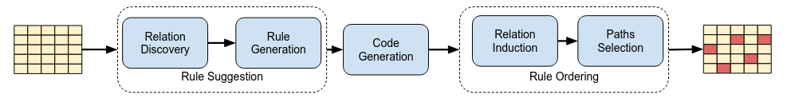

# ReaRClean

**ReaRClean** is an interactive, LLM-assisted data cleaning tool that combines domain expertise with automated rule suggestion, natural language rule-to-code generation, and dependency-aware execution. It is designed for structured data cleaning in settings where statistical signals are unreliable and cross-column constraints are essential.

Unlike traditional cleaning pipelines that rely either on column-wise statistical patterns or fully manual rule engineering, ReaRClean integrates Large Language Models to assist users in discovering, specifying, and operationalizing cleaning logic. The system keeps the domain expert in the loop while automating repetitive and error-prone parts of the workflow.

---

## ✨ Features

- 🧠 **Rule Suggestion**  
  Automatically suggests candidate cleaning rules by analyzing column names and data profiles, helping users uncover potential inconsistencies and cross-column relationships.

- ⚙️ **Natural Language to Code Generation**  
  Converts user-defined cleaning rules expressed in natural language into executable Python functions using code-oriented LLMs (e.g., Codestral), enabling non-programmatic rule specification.

- 🔄 **Dependency-Aware Rule Ordering**  
  Models inter-column dependencies induced by cleaning functions using a graph-based formulation and computes an effective execution order to improve overall consistency of the cleaned dataset.

- 🧑‍💻 **Interactive Cleaning Interface**  
  Provides a user-friendly UI for iteratively defining, refining, and applying rules with full transparency over each transformation step.

---

## 🏗️ Framework Overview



---

## 🚀 How to Use / Install

```bash
pip install -r requirements.txt
streamlit run app.py
```

---

## 🎬 Demo Video

[](https://youtu.be/ZiprUaBFCgs)
